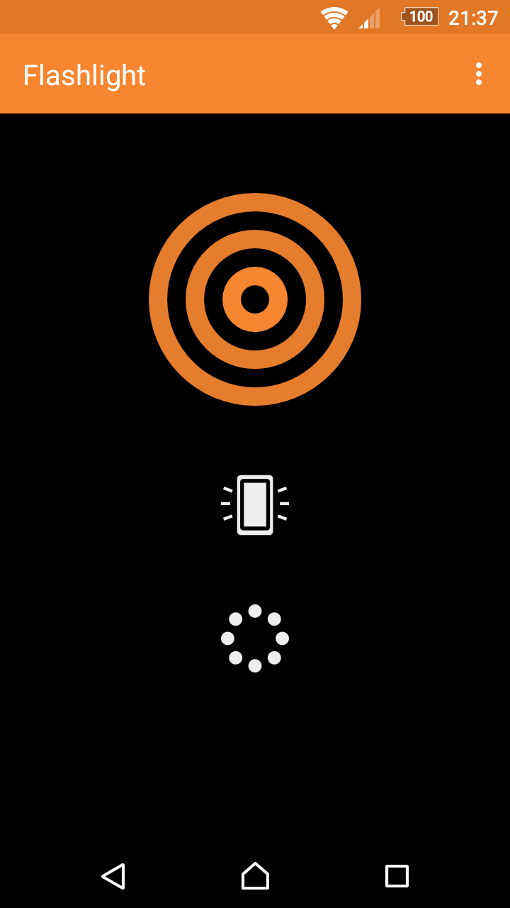
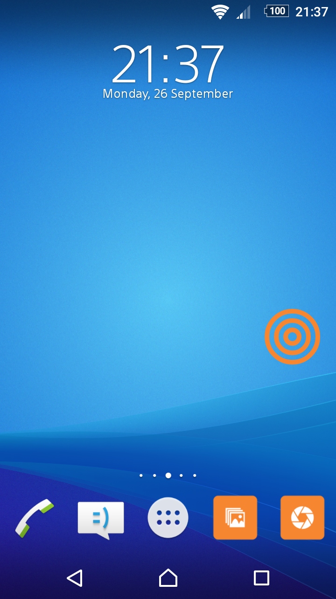

# SimpleFlashlight

I'm flashlight. Simple flashlight. With a widget.

A flashlight app with black background, so it doesn't knock you out when launched in the dark. If it's turned on via the app, it will prevent the device from falling asleep, so it can be used for longer operations too. It also contains a simple 1x1 widget you can place on your homescreen.

License
-------
    Copyright 2016 SimpleMobileTools
    
    Licensed under the Apache License, Version 2.0 (the "License");
    you may not use this file except in compliance with the License.
    You may obtain a copy of the License at
    
       http://www.apache.org/licenses/LICENSE-2.0
    
    Unless required by applicable law or agreed to in writing, software
    distributed under the License is distributed on an "AS IS" BASIS,
    WITHOUT WARRANTIES OR CONDITIONS OF ANY KIND, either express or implied.
    See the License for the specific language governing permissions and
    limitations under the License.
