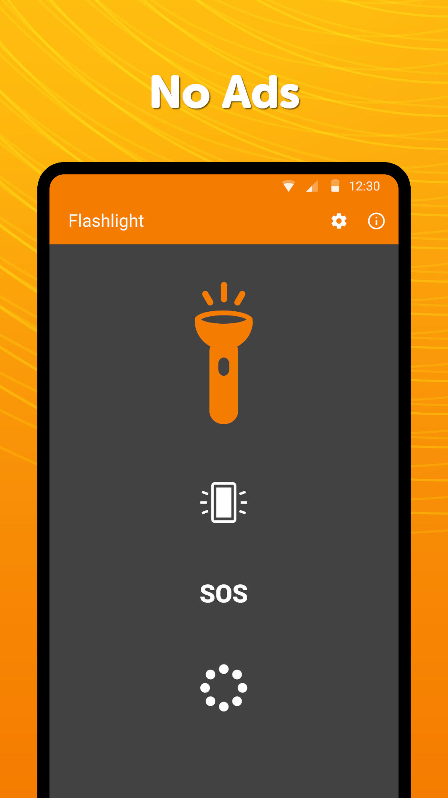
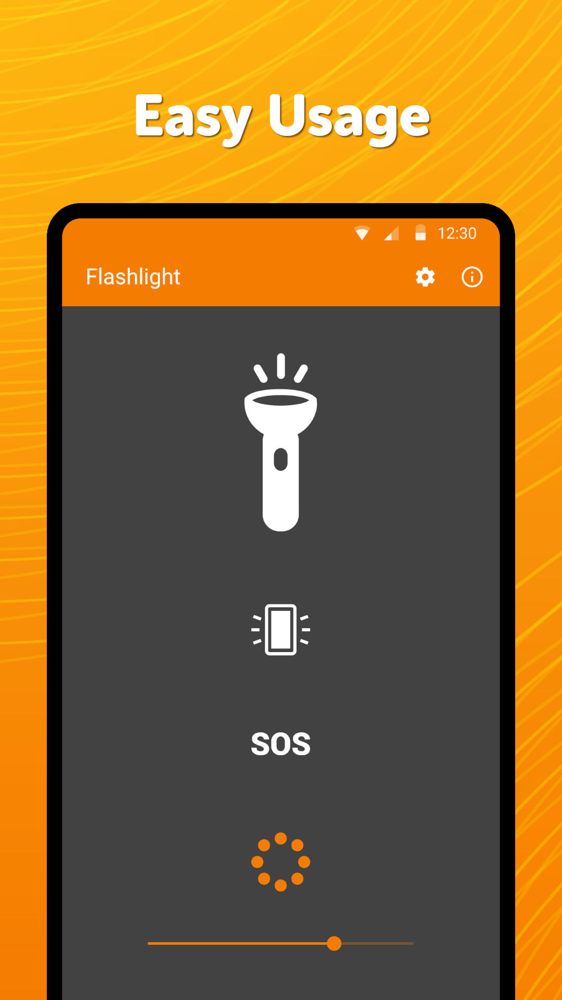

# Simple Flashlight

A clean flashlight with an extra bright display, customizable stroboscope and a predefined SOS mode.

All these functions can be hugely helpful under certain circumstances.

The Bright display can have its color changed, opening a new world of possible uses. It can come handy in case you want to see your wider proximity without blinding yourself.

The stroboscope can have its frequency changed, ranging from really fast blinking to occasional ones.

If this free flashlight is turned on via the app (not widget), it will prevent the device from falling asleep. The strong torch can optionally turn on at launching the app, but it isn\'t mandatory.

Comes with a 1x1 widget with customizable color and transparency.

It comes with material design and dark theme by default, provides great user experience for easy usage. The lack of internet access gives you more privacy, security and stability than other apps.

Contains no ads or unnecessary permissions. It is fully opensource, provides customizable colors.

Check out the full suite of Simple Tools here:  
https://www.simplemobiletools.com

Facebook:  
https://www.facebook.com/simplemobiletools

Reddit:  
https://www.reddit.com/r/SimpleMobileTools

