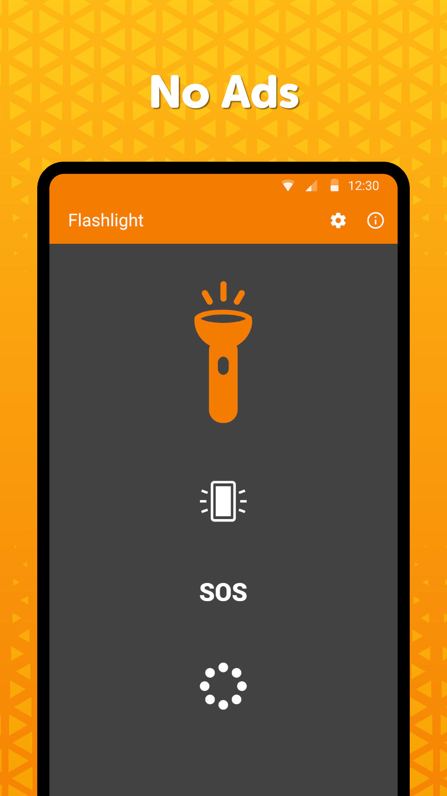
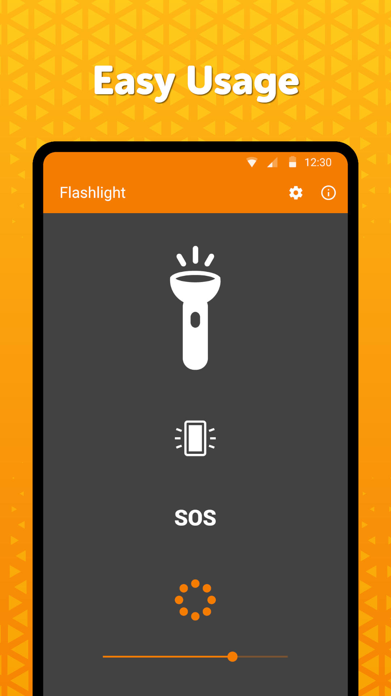
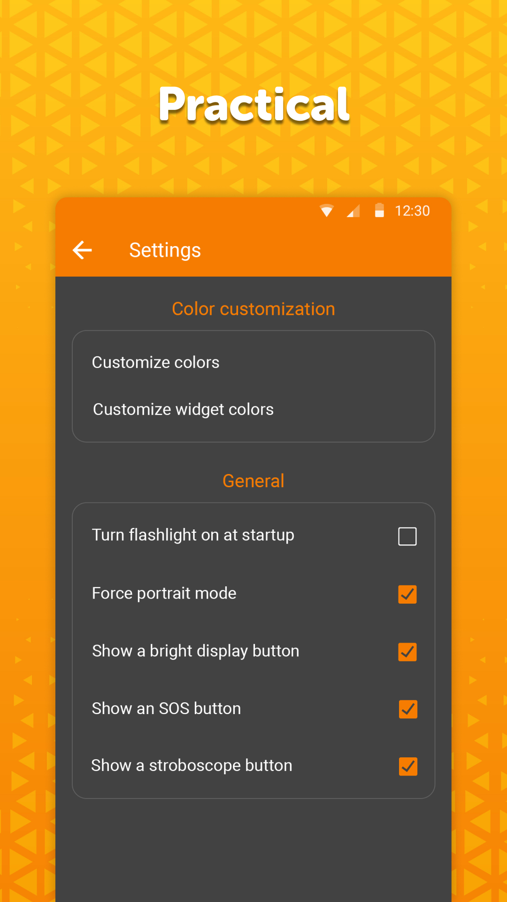

# Simple Flashlight

A clean flashlight with an extra bright display, customizable stroboscope with strobe light function and a predefined SOS mode. 

This quick start led flashlight is light on your device and works as a real led light when in dark. Using this slash light, you can easily work in different circumstances and this quick start led flashlight can help you when you are in a dire situation.

All these functions can be hugely helpful under certain circumstances. Whether you are wandering in dark and need a led light to see the way, or you have to find something in a a low light place, this quick start flash light can help you in all the possible circumstances. The strobe light in this app can help you when you are in need of help. The quick start flash led light can help calling for rescue if you need it.

The Bright display can have its color changed, opening a new world of possible uses. It can come handy in case you want to see your wider proximity without blinding yourself. With different colors, you can use this led light when you are with friends and want to have a party. Or you can use this feature to call someone for help according to the person. 

The stroboscope can have its frequency changed, ranging from really fast blinking to occasional ones. This quick start app can be customized according to your needs. You can change all the features of of this app according to your needs without any problem.

If this free flash light is turned on via the app (not widget), it will prevent the device from falling asleep. The strong torch can optionally turn on at launching the app, but it isn't mandatory.

Comes with a 1x1 widget with customizable color and transparency. This widget can help you in quick start your led light app whenever you need it.

It comes with material design and dark theme by default, provides great user experience for easy usage. The lack of internet access gives you more privacy, security and stability than other apps.

Contains no ads or unnecessary permissions. It is fully opensource, provides customizable colors.

<a href="https://f-droid.org/packages/com.simplemobiletools.flashlight">Get it on F-Droid</a>

Support us:  
IBAN: SK4083300000002000965231  
Bitcoin: 19Hc8A7sWGud8sP19VXDC5a5j28UyJfpyJ  
Ethereum: 0xB7a2DD6f2408Bce77334655CF5E7639aE31feb30  
Litecoin: LYACbHTKaM9ZubKQGxJ4NRyVy1gHUuztRP  
Bitcoin Cash: qz6dvmhq5vzkcsypxpp2mnur30muxdah4gvulx3y85  
Tether: 0x250f9cC32863E59b87037a14955Ed64F879653F0  
<a href="https://paypal.me/SimpleMobileTools?country.x=SK&locale.x=en_US">PayPal</a>  
<a href="https://www.patreon.com/tiborkaputa">Patreon</a>

