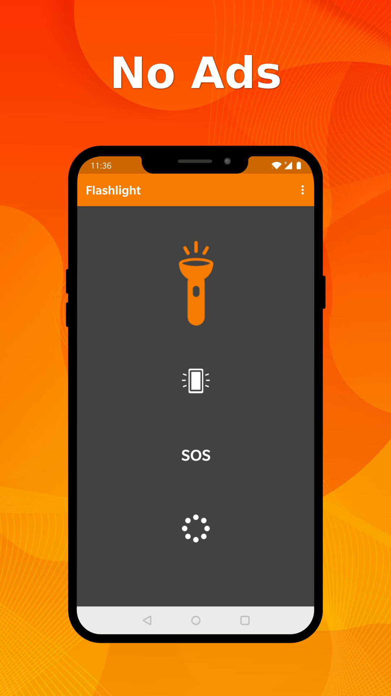
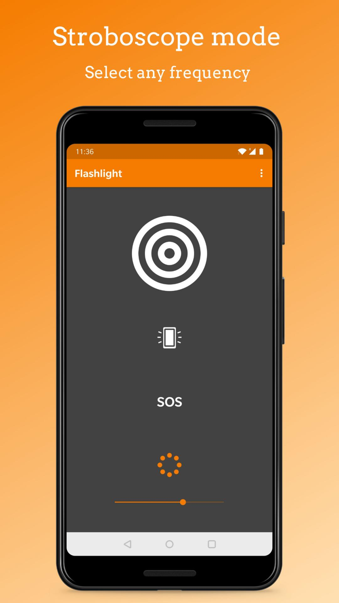

# Simple Flashlight

A clean flashlight with an extra bright display and customizable stroboscope. If turned on via the app (not widget), it will prevent the device from falling asleep.

Comes with a 1x1 widget with customizable color.

Contains no ads or unnecessary permissions. It is fully opensource, provides customizable colors.

This app is just one piece of a bigger series of apps. You can find the rest of them at https://www.simplemobiletools.com

